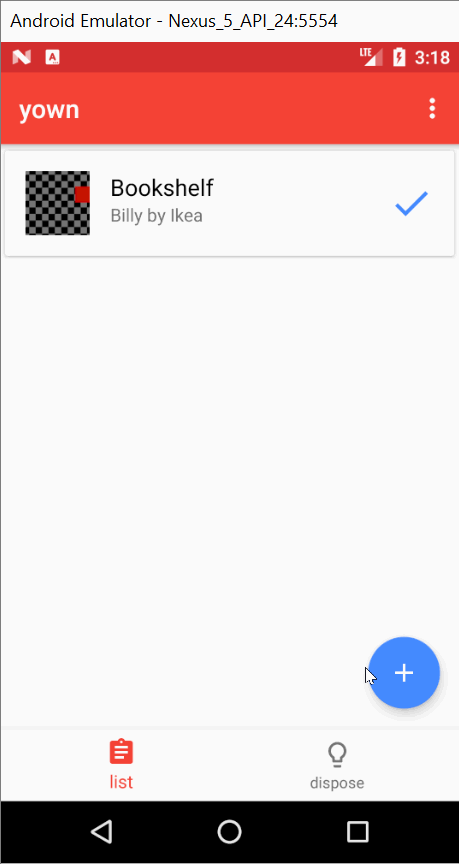

[](https://travis-ci.org/KarelZe/yown)
# Yown
yown (short for you own) is an android app to help you declutter and keep track of your inventory. It features NFC functionality for easy tracking of usage. It can suggest you, what to keep and what to let go.

This app is my coursework for ```CMP 309``` at Abertay University, Scotland.
## Preview


## Download
You can find my latest build [in the releases tab.](https://github.com/KarelZe/yown/releases)

## Todos
- [x] Create UI
- [x] Add intents to camera
- [x] Add call for result between activities
- [x] Add a database functionality
- [x] Replace Add details activity with dialog
- [x] Implement (advanced) sorting
- [x] Add NFC functionality
- [x] Refactor DB calls to Asynchronous Task
- [x] Add how to Activity using web view and custom HTML
- [x] Better user feedback on NFC
- [x] Enhance Settings Activity with debug console
- [x] Enhance Settings Activity with reset all functionality
- [x] Use Travis and GitHub releases for automated deploying
- [x] Code review

## Tutorial
You can find a short tutorial within the app or [here.](https://github.com/KarelZe/yown/blob/master/app/src/main/assets/index.html)

## Contact
Feel free to send me a  [mail](mailto:1705042@abertay.ac.uk)
